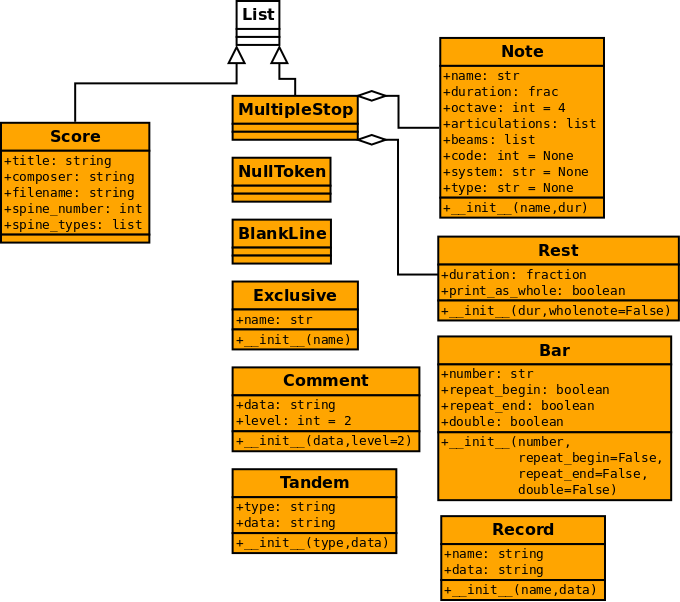

.. _score:

The Score data structure
========================

The basic data structure in the aristoxenus library is the class
:class:`Score`. It's modeled after the humdrum format and uses similar
terminology such as spines and interpretations. But this data
structure can be used independently of the humdrum format. Also, other
formats such as abc and lilypond can be parsed into the :class:`Score`
data structure.

We can see the class taxonomy for the Score data structure in the
following diagram:

The Score class
---------------

.. class:: aristoxenus.score.Score()

The class :class:`aristoxenus.score.Score` is a subclass of :class:`list`; you can
append and remove elements and use the slice operator. You can
instantiate a class with any number of arguments. For instance,
``Score(1, 2, 4)`` will return ``[1, 2, 4]``. Of course, you should
add music elements such as :class:`aristoxenus.score.Note`::

  Score(Note("C#"), Note("Bb"))

Every line of a humdrum file is parsed as an object and the result is
stored as an item of :class:`Score`. So, if we have ``s = Score()``,
``s[2]`` will return the third line of a parsed humdrum file. For
instance, the result of ``parse_string("**kern\n4c\n\n4d\n*-")`` will
be something like::

  [[<aristoxenus.score.Exclusive object at 0x7f982d7a9590>],
   [<aristoxenus.score.Note object at 0x7f982d715690>],
   [<aristoxenus.score.Note object at 0x7f982d715650>],
   [<aristoxenus.score.Tandem object at 0x7f982d715350>]]

.. attribute:: Aristoxenus.Score.title
               Aristoxenus.Score.composer

The attributes :attr:`Aristoxenus.Score.title` and :attr:`Aristoxenus.Score.composer` are
copied from reference records to allow easy and quick access to this
information (useful when generating data for notation programs).

.. attribute:: Aristoxenus.Score.filename

Name of the original humdrum file. Useful to generate files
with the same name but different extension.

.. attribute:: Aristoxenus.Score.spine_types

List of strings with the original types of spines (for instance,
``["kern", "dynam"]``).

.. attribute:: Aristoxenus.Score.spine_names

The attribute :attr:`Aristoxenus.Score.spine_names` is a list with the instrument
names, with None if a spine doesn't have an instrument name (a
``**dynam`` spine, for instance). There are three main ways to define
instrument names in humdrum. ``*I`` is for pre-defined instrument
names (see the Appendix II in the Humdrum Manual) and ``*I:`` is for
user-defined instrument names (proposed by Andreas Kornstaedt, but not
documented yet). A local comment can also be used to store an
instrument name but is difficult to parse automatically.

.. attribute:: Aristoxenus.Score.measure_numbers

The attribute:attr:`Aristoxenus.Score.measure_numbers` is a list with the position
of the beginning of every measure in the spine. It's intended to be
used to quickly extract measures from a aristoxenus.score.g

.. autofunction:: aristoxenus.score.make_notes

   It's a helper function to make notes quickly:

   >>> make_notes('C# Dbb Bb')
   [<__main__.Note object at 0x223cbd0>,
    <__main__.Note object at 0x223cb10>,
    <__main__.Note object at 0x2244550>]

The Note class
--------------

.. autoclass:: aristoxenus.score.Note

.. attribute:: Note.name

  A string with the note name in English such as "Ab" and "C##".

.. attribute:: Note.duration

  A fractional number indicating the duration or ``None`` for no
  duration.

.. attribute:: Note.octave

  An integer, where 4 is the central octave.

.. attribute:: Note.articulations

  A list of strings denoting an articulation such as "harmonic" and "turn".

.. attribute:: Note.beams

  A list of keywords denoting beam commands.

.. attribute:: Note.code

  Numeric code for the note name. For instance, if the
  :attr:`Note.name` is "Ab" the value for :attr:`Note.code` should be
  8 if :attr:`system` is "et12" and 31 if :attr:`system` is "base40".

.. attribute:: Note.system

  The numeric system used to parse the note. Values can be "et12",
  "base40", "base96" and so on.

The code number in the :class:`Note` class is calculated while the
notes are being parsed to provide some optimization. (i.e. the code
number doesn't have to be calculated after the file is parsed). It's
probably not a good idea to modify :attr:`Note.code` and
:attr:`Note.system` after the file has been parsed.

The Tandem class
----------------

.. autoclass:: aristoxenus.score.Tandem

The tandem class stores the kind of tandem interpretation as a string
in :attr:`Tandem.type` and the actual value in :attr:`Tandem.data`. The
following table shows each value :attr:`type` can have and the type
of :attr:`data`, with a brief example:

================ ============================ ========================
keyword          type of Tandem.data          example
================ ============================ ========================
"clef"           string                       "treble"
"instr-class"    string                       "vox"
"instr-group"    string                       "ripn"
"instrument"     string                       "bass"
"key-signature"  integer or list of strings   2 or ``["f#", "cb"]``
"tempo"          number                       88.8
"meter"          string                       "12/8" [#f1]_
"timebase"       number                       12
"transposing"    string                       "d1c2"
"key"            string                       "Ab"
"expansion-list" list                         ["verse1", "verse2"]
"label"          string                       "verse1"
================ ============================ ========================

If the key signature is one of the standard used in western tonal
music, a positive integer is used to indicate the number of sharps and
a negative integer to indicate the number of flats. If the key
signature is not standard (e.g. it has "Bb" and "F#") the notes are
saved in a list.

The instrument names follow the abbreviations in the Appendix II of
the humdrum manual. (See also :ref:`todo`).

.. rubric:: Footnotes

.. [#f1] It can't be a rational because tempos like 4/4 will be normalized to 1/1.

The Record class
----------------

.. autoclass:: aristoxenus.score.Record

Reference records are partially parsed and saved in the
:class:`Record` class. The reference codes are saved in
:attr:`Record.name` as a string (for example, "OTL@@FUR" and "OTL")
while the reference data is saved in :attr:`Record.data` (for example,
"Ai preit la biele stele"). The parser doesn't further process the
data in :attr:`Record.name`. The only exception is the reference code
for the title and composer, which are saved in the slots with the same
name in the :class:`Record` class. See section :ref:`todo` for things
that need to be done.

Other classes
-------------

.. autoclass:: aristoxenus.score.MultipleStop(list)

   A subclass of list used to store notes (:class:`aristoxenus.score.Note`) and
   rests (:class:`aristoxenus.score.Rest`). It'll look like a list, but can be
   tested with :func:`isinstance`.

.. autoclass:: aristoxenus.score.Comment
.. autoclass:: aristoxenus.score.Exclusive
.. autoclass:: aristoxenus.score.Bar
.. autoclass:: aristoxenus.score.Rest
.. autoclass:: aristoxenus.score.NullToken
.. autoclass:: aristoxenus.score.BlankLine
.. autoclass:: aristoxenus.score.Dynam
